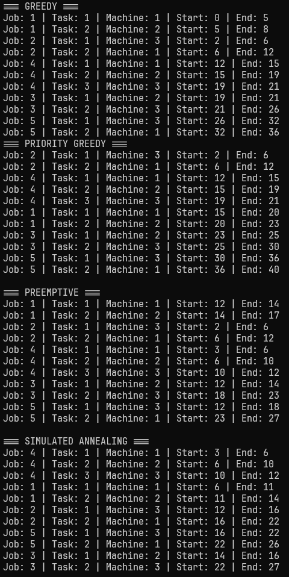
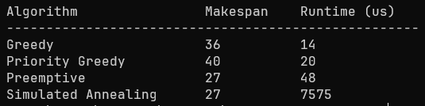

# Job Shop Scheduler

A C++ project that implements and benchmarks Greedy, Priority Greedy, Preemptive, and Simulated Annealing scheduling algorithms on a dynamic job shop.

Built this to understand how scheduling algorithms handle real supply chain constraints, jobs arriving at different times, machines being shared, and urgent orders jumping the queue.




## Results

Greedy finishes in 14us but gets a makespan of 36 (fast but not great). Priority Greedy is slightly slower at 20us but actually does worse (makespan 40) because reordering by priority creates machine idle time. Preemptive hits the optimal makespan of 27 in just 48us by interrupting low-priority tasks when urgent jobs arrive. Simulated Annealing also hits 27 but takes 7575us to get there, 158x slower than Preemptive for the same result.


## Build & Run

```bash
g++ -std=c++17 -Wall -o scheduler main.cpp greedy.cpp priority_greedy.cpp preemptive.cpp simulated_annealing.cpp
./scheduler jobs.csv machines.csv
```

## Input Format

**jobs.csv**

job_id,priority,arrival_time,machine_id,process_time
1,NORMAL,0,1,5
1,NORMAL,0,2,3
2,URGENT,2,3,4
2,URGENT,2,1,6
3,NORMAL,5,2,2
3,NORMAL,5,3,5
4,URGENT,3,1,3
4,URGENT,3,2,4
4,URGENT,3,3,2
5,NORMAL,8,3,6
5,NORMAL,8,1,4

Each row is one task. Jobs with multiple tasks share the same `job_id` and tasks are processed in order.

**machines.csv**

machine_id
1
2
3

## Algorithms

- **Greedy** - schedules jobs in arrival order, assigns each task to its required machine as early as possible
- **Priority Greedy** - same as greedy but processes urgent jobs before normal ones
- **Preemptive** — real-time simulation with a global clock where urgent jobs interrupt running normal tasks mid-execution
- **Simulated Annealing** - tries random job orderings, keeps better ones, and occasionally keeps worse ones to avoid getting stuck. Cools down over time until it settles on a near-optimal schedule